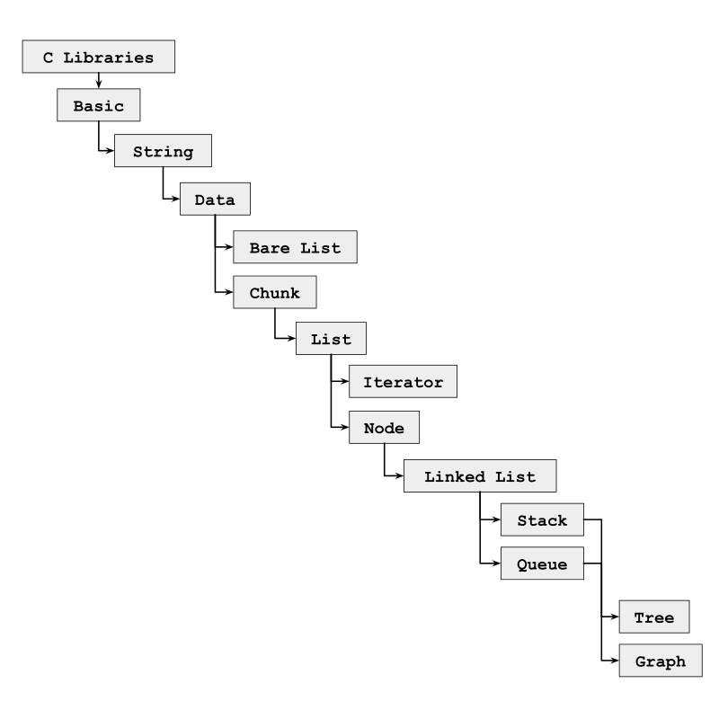

# Data Structures and Algorithms
Custom C Library for data-structures and algorithms

## Overview

- Data Structures is a minimal object generator that is written and run in C language.

### Included Data-Structures & Utility Functions =>

Click on the links below to know details about them.

- [Basic](/docs/basic.md)
- [String](/docs/string.md)
- [Data](/docs/data.md)
- [Bare_List](/docs/bare_list.md)
- [Chunk](/docs/chunk.md)
- [List](/docs/list.md)
- [Node](/docs/node.md)
- [Linked_List](/docs/linked_list.md)
- [Stack](/docs/stack.md)
- [Queue](/docs/queue.md)
- [Tree](/docs/tree.md)
- [Graph](/docs/graph.md)

### Dependency Diagram =>

___

## History

- Hi, this is the inititiator of this repo. From the college days it was a trial to create a general purpose data-structure and algorithm (DSA) in C programming language.

- Please try this tool on systems (computer, mobile, embded systems) after installing GCC (GNU Compiler Collections) or Clang compiler; compile and run it natively or in servers.

## [🤝 Contributing](./CONTRIBUTING.md)

## [📜 Code of Conduct](./CODE_OF_CONDUCT.md)

## [🔒 Security](./SECURITY.md)
___

## Credits

## 💝 Support

If you like this DSA Project and would like to support & appreciate it via donation then I'll gladly accept it. 

